# Instalasi Fedora 39

Fedora 39 sudah release, mari kita install.

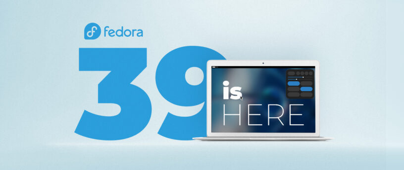

## Download ISO image

Download di **[https://fedoraproject.org/](https://fedoraproject.org/)**.
Pilih Fedora Workstation dan pilih Live ISO Intel dan AMD.

## Boot ISO di Virtual Machine atau PC

Boot ISO di Virtual Machine atau PC.

Versi ini pakai VMWare Player 17.

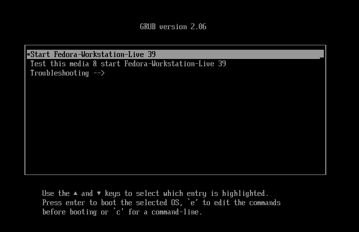

## Instalasi

1. Installer

  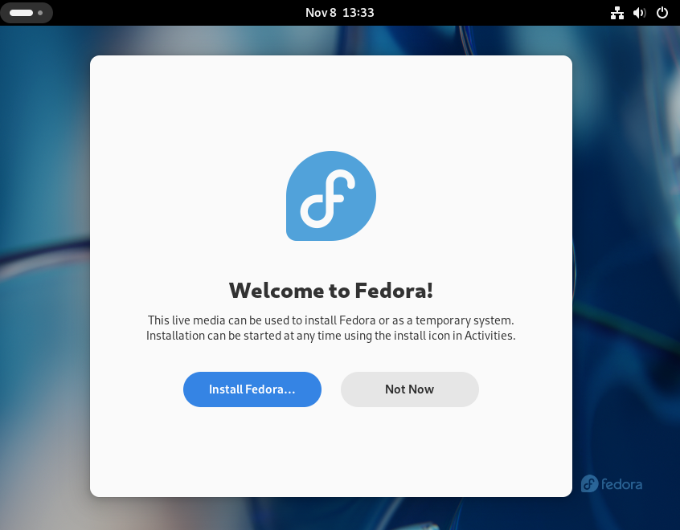

2. Pilih bahasa
  
  Gunakan bahasa inggris / English
  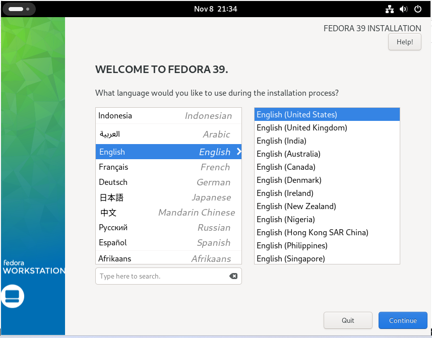

3. Menu instalasi

  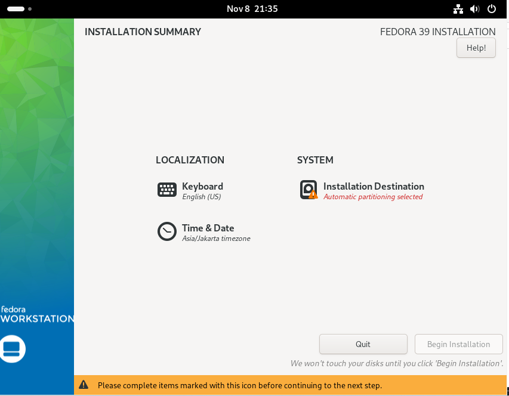

4. Pilih disk

  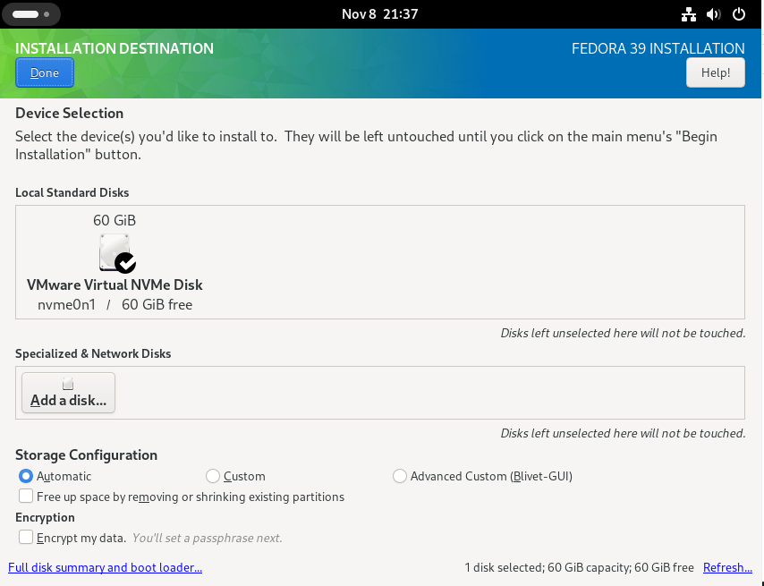

5. Mulai instalasi

  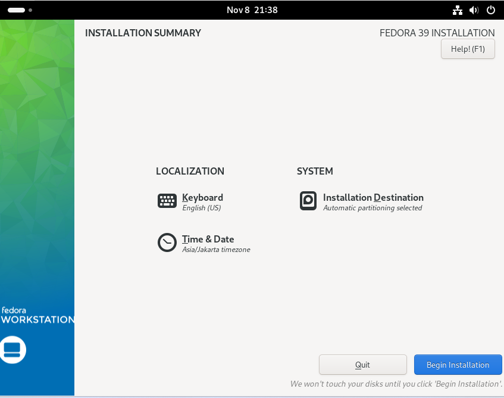

6. Tunggu instalasi

  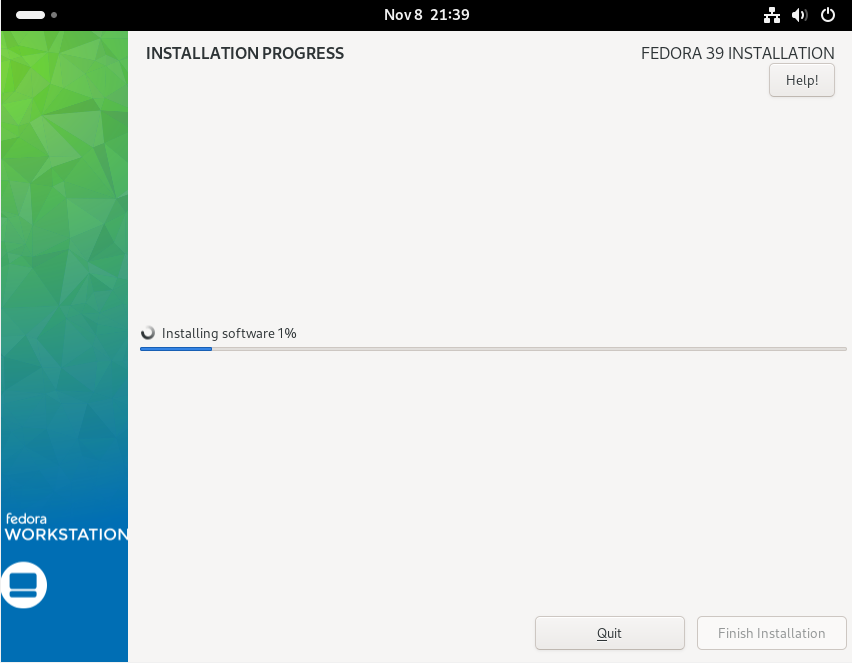

7. Install selesai

  Restart live CD jika selesai.
  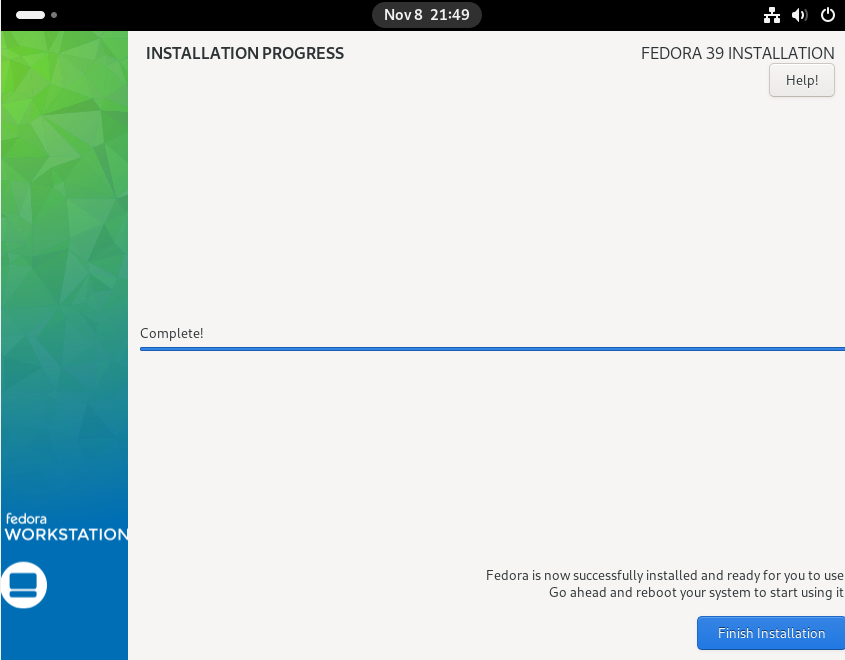

## Booting dan setup pertama setelah instalasi

1. Pilihan privacy

  Disable kirim data aplikasi error.
  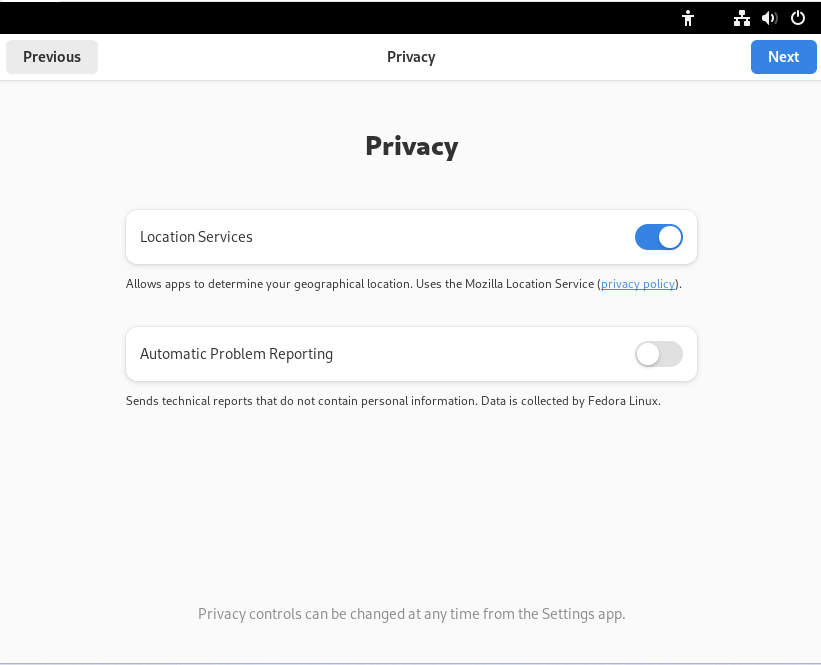

2. Repositori dari Third Party

  Aktifkan untuk repositori tambahan.
  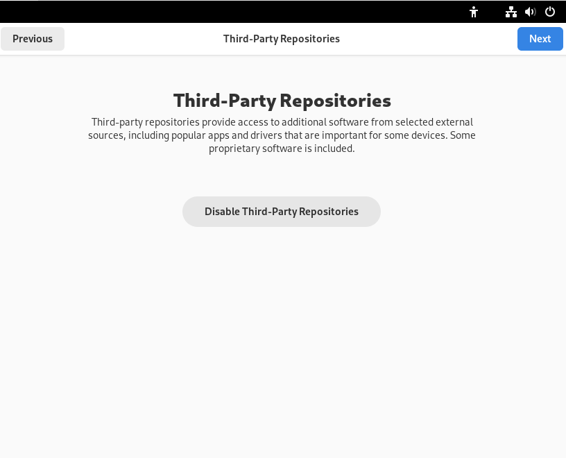

3. Akun online

  Tidak perlu, skip.
  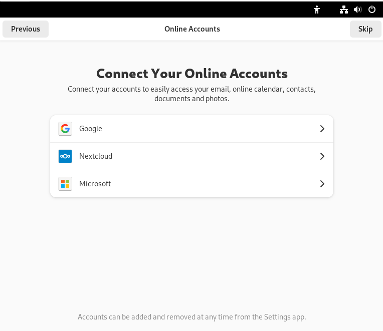

4. Buat username dan password

  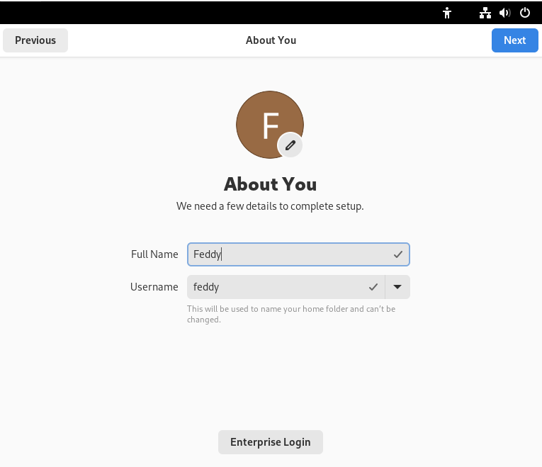

5. Buat password user

  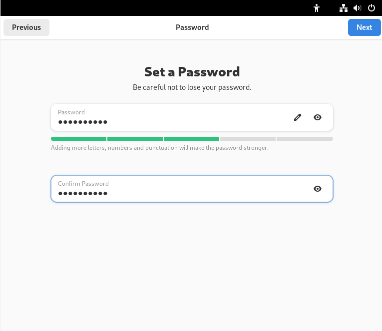

6. Selesai setup awal dan login

  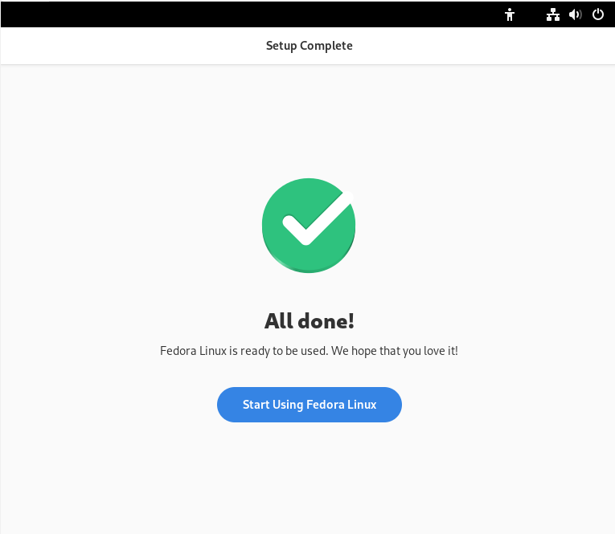

## Selesai dan halaman setelah login

  Desktop linux GNOME, bawaan default Fedora sudah bisa dipakai.
  
  